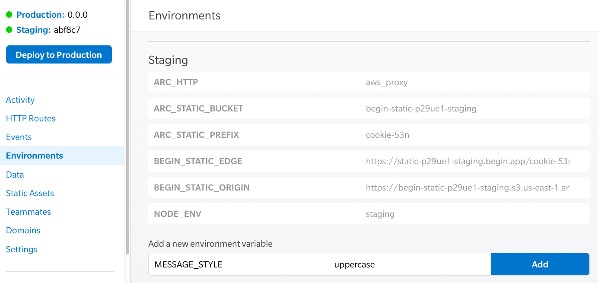

# Serverless API Example with Begin and Architect

## Foundations
The following examples are completely based on [Free Code Camp's APIs and Micro-services Certification: Basic Node and Express](https://www.freecodecamp.org/learn/apis-and-microservices/basic-node-and-express/). 

In this repo, I will document and recreate the same functionality, but with [serverless architecture](https://arc.codes) to include single use functions, shared middleware, and static hosting with automated deployments through [Begin](https://begin.com).

Click the button to deploy this app to live infrastructure on Begin.

[](https://begin.com/apps/create?template=https://github.com/pchinjr/fcc-apis-microservices-serverless)

$BADGE

Once your app is deployed, clone the repo Begin creates and `npm install`. 
```bash
git clone https://github.com/username/begin-app-project-name.git
cd begin-app-project-name
npm install
npm start
```

## Function logs and the Node console
`console.log('got here')` is probably my most used debugging tool. It's a simple way to walk through your code execution and inspect different logic paths. To view logs in Begin, go to your Begin console and inspect the route you want. Each function is isolated and has it's own execution environment. In our case, it's a Node environment. When your function is invoked with an HTTP method, AWS will bring up your function code, execute it, and wipe out it's memory. Each time that function is called, it behaves as if it is being run for the first time. This is different from a regular Express server that is long living and can retain data between route invocations. We'll talk about how to persist information in a separate repo. If you are eager to skip ahead to sessions and data persistence, check out [https://learn.begin.com](https://learn.begin.com)

Let's add a `console.log()` statement to the `get-index` function. 

```js
// src/http/get-index/index.js
let body = `
<!doctype html>
<html lang=en>
  <head>
    <meta charset=utf-8>
    <title>Hi!</title>
    <link rel="stylesheet" href="https://static.begin.app/starter/default.css">
    <link href="data:image/x-icon;base64,iVBORw0KGgoAAAANSUhEUgAAAAEAAAABCAQAAAC1HAwCAAAAC0lEQVR42mNkYAAAAAYAAjCB0C8AAAAASUVORK5CYII=" rel="icon" type="image/x-icon">
  </head>
  <body>
    <h1 class="center-text">
     Praise Cage! 
    </h1>
    <p class="center-text">
      Your <a href="https://begin.com" class="link" target="_blank">Begin</a> app is ready to go!
    </p>
  </body>
</html>
`
exports.handler = async function http(req) {
  console.log('Praise Cage')
  return {
    headers: {
      'content-type': 'text/html; charset=utf8',
      'cache-control': 'no-cache, no-store, must-revalidate, max-age=0, s-maxage=0'
    },
    body
  }
}
```
Now when you visit your index route you should see the console output: 


## Serverless HTML and static assets

In the FCC Express challenge, they show you how to create a web server by instantiating Express and opening a port for the server to listen on. With serverless functions, you don't need to create that abstraction. HTTP requests are handled by AWS API Gateway, a service that acts like a web server. When users make a request, each route is handled by a specific Lambda function. This gives us the ability to only write logic that pertains to the request and response needed by that route. It also has added security because the control of that function is only allowed by your app on your Begin domain. Architect takes care of IAM roles and service permissions when your code is deployed. 

The combination of code and the underlying infrastructure is called "Infrastructure as Code". We achieve this by writing a manifest called `app.arc` in the root of the project. Architect captures cloud resources and associated function code in a single file. 

So let's take a look at it now. 

```md
# app.arc
@app
fcc-apis   # app namespace - this helps organize the backend resources

@static    # declaration of static assets, defaults to the /public folder
 
@http      # declaration of HTTP routes, each route has it's own function handler organized by folder
get /      # the function handler is found in /src/http/get-index/index.js
```
Each function is self contained in it's own function folder according to route and HTTP method. One failing function won't take down the entire app, just the code behind that route. 

To start serving HTML and static assets, we can put them into the `/public` folder, and refactor our `get-index` handler to proxy requests to the root with contents of the public folder. We're also going to use a helper function from `@architect/functions` which makes working with HTTP and Lambda functions more Express-like. The `arc.http.proxy` function accepts a config object but we have no config to set in this example. This proxy will serve files in `/public` when the root index is requested. Otherwise, it would ignore `public/index.html` and just return the output of the `get-index` function.

So now we can modify our original `get-index` function to only the following:
```js
// src/http/get-index/index.js
let arc = require('@architect/functions')
exports.handler = arc.http.proxy.public()
```

## Serve JSON on a specific route
The heart of a REST API is specifying resources with a URL path, and an HTTP method. The method is defined by `app.arc`, which tells API Gateway how to interpret the HTTP request on a route. That path could return JSON data, an HTML string, or any other kind of text. In this section, we want to return JSON at the route `/json`. Setting it up means adding this route to `app.arc` and writing a `get-json` handler function.

```md
# app.arc
@http
get /json
```
```js
// src/http/get-json/index.js
exports.handler = async function http (req) {
  let message = "Hello json"
  return {
    headers: {
      "content-type": "application/json; charset=utf-8"
    },
    body: JSON.stringify({"message": message})
  }
}
```

## Environment Variables
Environment variables are values that can be used during runtime. We typically hold sensitive information like API keys and configuration secrets that should not be stored in `.git`. In order to use environment variables with Sandbox, our development server, we need to create a `.arc-env` file. Then we can add `staging` and `production` environment variables in the Begin Console.

```
# .arc-env
@testing
MESSAGE_STYLE uppercase
```

Refactor `get-json` to check for the environment variable `MESSAGE_STATUS`

```js
// src/http/get-json/index.js
exports.handler = async function http (req) {
  let message = "Hello json"

  // new code to check for environment variable
  if (process.env.MESSAGE_STYLE==="uppercase") {
    message = message.toUpperCase() 
  }

  return {
    headers: {
      "content-type": "application/json; charset=utf-8"
    },
    body: JSON.stringify({"message": message})
  }
}
```
Add the environment variable in the Begin Console by navigating to "Environments", typing in your key and value, and clicking `add`. Note that there are different areas for `staging` and `production`.



## Root-level request logger and middleware

In order to create a logger on every request, we can use a special folder called `src/shared` to create utilities that multiple functions can access. Since each function is isolated, Architect will copy everything in `src/shared` into the `node_modules` folder of every function. We will start with declaring a new route, writing a handler function, and writing a logger utility function.

```md
# app.arc
@http
get /now
```
```js
// src/shared/utils.js
// takes a request and logs the HTTP method, path, and originating public IP address.
function logger(req){
  console.log(`${req.httpMethod} ${req.path} - ${req.headers['X-Forwarded-For']}`)
  return
}

module.exports = logger
```

Now you can add `logger()` to any function you want by requiring it at the top. We can combine the shared code with an Express style middleware in `@architect/functions` to complete the next challenge. 

```bash
cd src/http/get-now/
npm init -y
npm install @architect/functions
```
```js
// src/http/get-now/index.js

// require logger and @architect/functions
let logger = require('@architect/shared/utils')
let arc = require('@architect/functions')

// first function call to modify the req object
function time(req, res, next) {
  req.time = new Date().toString()
  next()
}

// response function with response object
function http(req, res) {
  let time = `Praise Cage! The time is: ${req.time}`
  res({
    "json": {time: time}
  })
}

// arc.http registers multiple functions and executes them in order
exports.handler = arc.http(time, http)
```
`arc.http` registers multiple functions. Each function will get executed to modify the `req` object. If a function does not end the request/response cycle, it must call `next()` and the final function must call `res()`

To learn more about the `arc.http` request and response methods, check out https://arc.codes/reference/functions/http/node/classic. 

## Get route(path) parameter input from the client

In this function, we will build an echo endpoint to respond with a JSON object of the word that is passed in as a request parameter. Add a new endpoint to `app.arc` and write a corresponding handler function. 

```md
# app.arc
@http
get /echo/:word
```
```js
// src/http/get-echo-000word/index.js
exports.handler = async function http(req){
  let { word } = req.pathParameters
  return {
    headers: {
      'content-type':'application/json; charset=utf-8'
    },
    body: JSON.stringify({ echo: word})
  }
}
```
A GET request to `/echo/freecodecamp`, will result in a request object that has a property `pathParameters` with the object `{ word: 'freecodecamp'}` as a value. This is useful for dynamic routes like `users` or `postId` where the route can be appended with any string that you can catch and reference.

## Get query parameter input from the client

Another way to pass data to your API endpoint uses query parameters. We're going to add a `get-name` HTTP route with a corresponding handler. 

```md
# app.arc
@http
get /name
```
```js
// src/http/get-name/index.js
exports.handler = async function http(req, res) {
  let { first, last } = req.queryStringParameters
  return {
    headers: {
      'content-type':'application/json; charset=utf-8'
    },
    body: JSON.stringify({
      "name": `${first} ${last}`
    })
  }
}
```
A GET request to `/name?first=nic&last=cage`, will result in a request object that has a property `queryStringParameters` with the object `{ first: 'nic', last: 'cage' }` as a value. We can treat this similarly to route parameters.

## Parse request bodies and data from POST requests
Another way to receive data is from a POST request as an HTML form. HTML forms allow the browser to submit data to the server-side without using JavaScript. The data is part of the HTTP payload in the request body. In this example, we are using `urlencoded` body. Architect uses Base64 encoded strings for all request bodies, and we have a helper method in `@architect/functions` to help parse request bodies. Since each function is isolated, we will have to install and manage dependencies per function folder. 

But first, let's set up a `post-name` function and route. 

```md
# app.arc
@http
post /name
```
Then we can install `@architect/functions` for the body parser.
```bash
cd src/http/post-name
npm init -y
npm install @architect/functions
```
Now let's write the function handler 

```js
// src/http/post-name
let arc = require('@architect/functions')

exports.handler = async function http(req) {
  let {first, last} = arc.http.helpers.bodyParser(req)
  return {
    headers: {"Content-type": "application/json; charset=UTF-8"},    
    body: JSON.stringify({
      name: `${first} ${last}`
    })
  }
}
```
Now you can use `index.html` to submit a form with any name you would like, i.e. Nic Cage, and the `post-name` handler with reply with `{ "name": "Nic Cage"}`.

## Infrastructure as Code
This is a serverless approach to building a REST API and serving static assets. Take a look at your final `app.arc` file, and you will see an entire rundown of your entire app.

```md
# app.arc
@app
fcc-apis

@static

@http
get /             # root proxy to static assets
get /json         # deliver JSON data
get /now          # 
get /echo/:word   # get path parameters
get /name         # get query string parameters
post /name        # process html form data

@tables
data
  scopeID *String
  dataID **String
  ttl TTL
```

Each commit to your default `.git` branch triggers a deploy to `staging` on Begin. When you are ready for production, click `Deploy to Production` in your Begin Console and say "Hello" to Ship-it Squirrel.

>> For extra funsies, you can see the original FCC Express app with all the same capabilities, running in a single giant Lambda function. You can see that code here: [https://github.com/pchinjr/boilerplate-express](https://github.com/pchinjr/boilerplate-express)