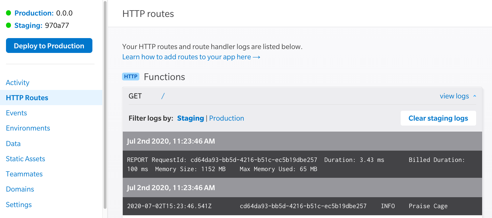

# Serverless API Example with Begin and Architect

## Foundations
The following examples are completely based on [Free Code Camp's APIs and Micro-services Certification: Basic Node and Express](https://www.freecodecamp.org/learn/apis-and-microservices/basic-node-and-express/). 
The original challenge has twelve sections to pass. Unfortunately their test methods are not 100% compatible with a serverless backend because it is relying on a background process to test against. Serverless functions remain stateless and do not retain any memory between invocations. This means that the FCC test server can not reliably have the same results as it is written. I have however been able to replicate the entire process with Express inside of a mono-lambda. You can see that code here: [https://github.com/pchinjr/boilerplate-express](https://github.com/pchinjr/boilerplate-express)

In this repo, I will document and recreate the same functionality to build an API, but with discrete architecture to include single use functions, shared middleware, and static hosting on serverless infrastructure with automated testing and deployments through [Begin](https://begin.com) and GitHub.

To start, make sure you have NodeJS installed and a GitHub account. You can click the button below to create and deploy an app to live infrastructure on Begin.

[](https://begin.com/apps/create?template=https://github.com/pchinjr/fcc-apis-microservices-serverless)


## Function Logs and the Node Console
`console.log('got here')` is probably my most used debugging tool. It's a simple way to walk through your code execution and inspect different logic paths. To view logs in Begin, go to your Begin console and inspect the route you want. Each function is isolated and has it's own execution environment. In our case, it's a Node environment. When your function is invoked with an HTTP method, AWS will bring up your function code, execute it, and wipe out it's memory. Each time that function is called, it behaves as if it is being run for the first time. This is different from a regular Express server that is long living and can retain data between route invocations. We'll talk about how to persist information in a separate repo. If you are eager to skip ahead to sessions and data persistence, check out [https://learn.begin.com](https://learn.begin.com)

So let's add a simple `console.log()` statement to the `get-index` function.

```js
// src/http/get-index/index.js
let body = `
<!doctype html>
<html lang=en>
  <head>
    <meta charset=utf-8>
    <title>Hi!</title>
    <link rel="stylesheet" href="https://static.begin.app/starter/default.css">
    <link href="data:image/x-icon;base64,iVBORw0KGgoAAAANSUhEUgAAAAEAAAABCAQAAAC1HAwCAAAAC0lEQVR42mNkYAAAAAYAAjCB0C8AAAAASUVORK5CYII=" rel="icon" type="image/x-icon">
  </head>
  <body>

    <h1 class="center-text">
     Praise Cage! 
    </h1>

    <p class="center-text">
      Your <a href="https://begin.com" class="link" target="_blank">Begin</a> app is ready to go!
    </p>

  </body>
</html>
`

exports.handler = async function http(req) {
  console.log('Praise Cage')
  return {
    headers: {
      'content-type': 'text/html; charset=utf8',
      'cache-control': 'no-cache, no-store, must-revalidate, max-age=0, s-maxage=0'
    },
    body
  }
}
```
Now when you visit your index route you should see the console output: 
